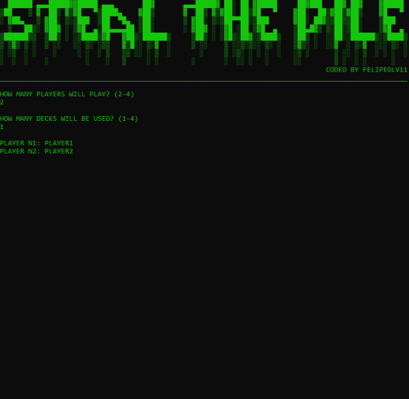
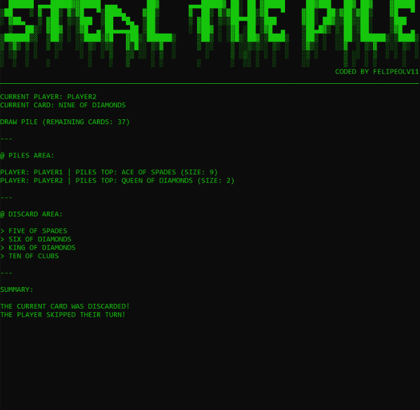
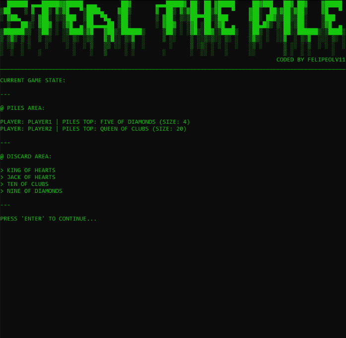
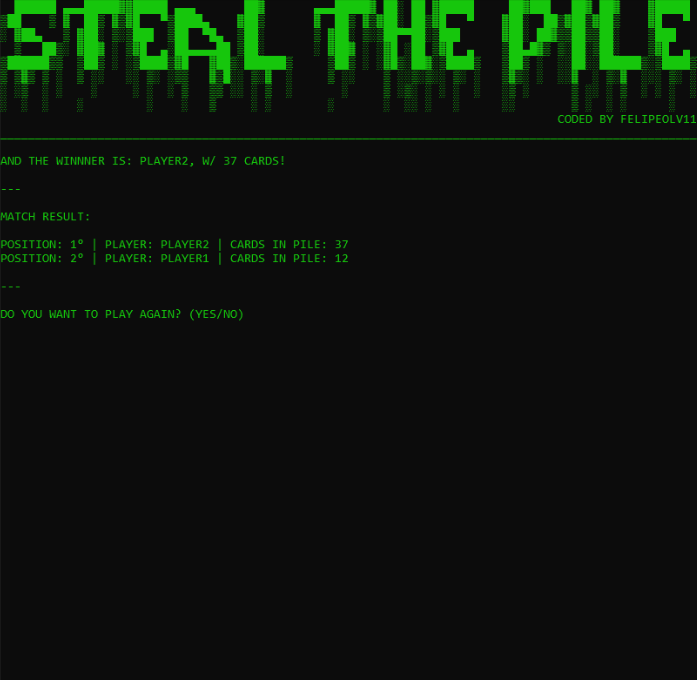

# 🃏 Steal the Pile

> A **console-based card game** in **C#**, inspired by the original game *Steal the Pile*.

## 📌 Note 

A remake of an academic project from my 2nd semester, made to improve my skills in **object-oriented programming**, **collection handling** and **turn-based logic** in a console app using C#.

## 💡 Features

- **Player**:
  - Take a card that matches the current card from the opponent, discard pile, or draw pile
  - Add a card to the discard pile
  - Skip turn if taking a card is not possible; may draw another card otherwise

## 🛠️ Built With

- C# (.NET)
- Console Application